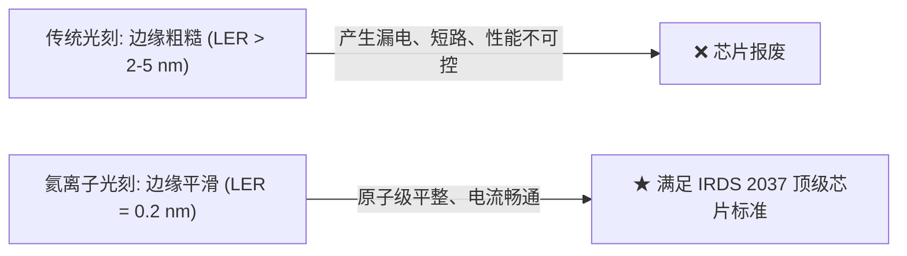

# 🎈 芯片画画大作战：小白也能秒懂的氦离子光刻与蒙特卡洛模拟
**—— 从“乒乓球与保龄球”讲透亚纳米线边缘粗糙度 (Sub-nanometer LER) 的终极奥秘**

---

## 🧐 1. 我们到底在折腾啥？（实验的终极目标）

现代芯片（比如手机里的 3nm / 2nm CPU）之所以越来越强，是因为科学家在指甲盖大小的硅片上，雕刻了几百亿根比头发丝还要细数万倍的“纳米导线”。



* **什么是线边缘粗糙度 (LER, Line Edge Roughness)？**  
  想象你在纸上画一条直线。如果你用一把毛躁的刷子画，线条的边缘就会像**“狗啃的锯齿”**一样凹凸不平。这种边缘参差不齐的起伏程度，物理上就叫 **LER**。
* **为什么 LER 必须极小？**  
  国际半导体技术路线图（IRDS）规定，未来先进芯片的 LER 必须小于 **0.5 纳米**（大约只有 2-3 个原子的宽度！）。如果边缘起伏太大，导线就会漏电、发热甚至直接烧毁。
* **本实验的战绩**：  
  利用这套方案，科学家们制造出了只有 **0.2 纳米 LER** 的超平滑纳米线条，直接突破了人类微纳加工的物理极限！

---

## 🥊 2. 两支神仙画笔的大对决：电子束 (EBL) vs 氦离子 (HIL)

为了在纳米尺度画线，科学家手里有两支最尖端的粒子束画笔：

```mermaid
graph TD
    subgraph EBL【电子束画笔】
    E1["电子质量极轻 (像乒乓球)"] --> E2["打入果冻四处乱弹<br/>(前向散射)"]
    E2 --> E3["撞击桌底大范围反弹<br/>(背散射迷雾 SE2)"]
    E3 --> E4["❌ 邻近效应严重<br/>线条边缘如狗啃 (LER > 5 nm)"]
    end

    subgraph HIL【氦离子画笔】
    H1["氦离子质量极重 (像保龄球, 7300倍)"] --> H2["像激光一样笔直穿透<br/>(零偏转, 轨迹准直)"]
    H2 --> H3["激发的二次电子能量极低<br/>(扩散半径 < 0.8 nm)"]
    H3 --> H4["★ 绝无旁向污染<br/>线条平滑如刀切 (LER = 0.2 nm)"]
    end
```

> **画笔物理原理解密**：
> 1. **电子束 (EBL)**：发射的是“电子”。电子实在太轻了（像**轻飘飘的乒乓球**），打进光刻胶（一层薄薄的**果冻**）时，会被原子撞得四处乱飞（**前向散射**）。更要命的是，它穿透果冻撞到下面的硬桌子（基底）后，会**狠狠反弹回来，把隔壁本来不想画画的地方全弄脏了**，这就是困扰芯片行业几十年的**“邻近效应 (Proximity Effect)”**。
> 2. **氦离子束 (HIL)**：发射的是“氦离子”。它的质量是电子的 **7300 多倍**（像**重磅保龄球**）。保龄球砸进果冻，挡路的原子根本撞不动它，它直接**笔直向下（高度准直）**，绝不乱偏！

---

## 🪄 3. 实验的独门绝技：悬空薄膜“能量滤波器” (Energy Filter)

就算保龄球很重，如果桌子太厚太硬，保龄球砸进基底深处（~300 nm）停下来时，也会在底部引起微弱的散射。

这篇论文（Zhuang et al. 2024）最天才的设计，就是——**把桌子挖空！**

* 他们把光刻胶涂在了一层只有 **20 纳米厚（薄如蝉翼）的悬空氮化硅薄膜（SiNx Membrane）**上。
* 当保龄球（氦离子）以 30,000 伏特的高速冲下来时，它轻松穿透光刻胶和薄膜，然后**直接飞到底部的虚空（真空）中去了**！
* **结果**：留在光刻胶里的只有最纯净、最笔直的能量，底部的反弹（背散射二次电子 SE2）被**100% 彻底消灭**！这层悬空薄膜就像一个神奇的**“能量过滤器”**。

---

## 🎲 4. 什么是“蒙特卡洛模拟”？（我们是怎么算出来的？）

“蒙特卡洛”是世界著名的赌场。科学家借用这个名字，是因为微观粒子的碰撞本质上就是**“电脑扔骰子”**：

一个粒子打进去，撞击后究竟是偏左 1 度还是偏右 2 度？计算机根据量子力学和原子散射公式随机“扔骰子”。只要我们让电脑连续扔几十万次骰子，追踪成千上万个粒子的运动轨迹，就能分毫不差地绘制出能量在空间中的真实分布！

---

## 🖼️ 5. 看懂四大大师级模拟结果（科学四大金刚）

---

### 🌟 图 1：微观碰撞与能量包络（看谁溅得远）

展示粒子在光刻胶与基底中的能量沉积热力图，黄色实线代表 **50% 核心能量**，深灰虚线代表 **90% 能量**，细点线代表 **99% 能量外围边界**。


> **图 1 核心看点（限制电子扩散）：**
> * **左边两幅图（EBL 电子束）**：99% 的能量向外扩散了几百甚至几千纳米！电子像在纸上滴了一大滴墨水，瞬间晕开了一大片。
> * **右边两幅图（HIL 氦离子）**：99% 的能量被死死捆在一根细细的红线内（$< 1\text{ nm}$），就像一把极细的纳米手术刀，能量绝不乱溅！
> * **电压的影响（30kV vs 100kV）**：电子束提升到 100kV 后像穿甲弹一样打入极深处，但扩散面积依然巨大；而氦离子在 100kV 下更是笔直如激光！

---

### 🌟 图 2：笔尖有多锋利？（点扩散函数 PSF 与 NILS 梯度）

将微观碰撞转换为连续的空间能量传递函数，衡量笔尖的锐利度与边缘清晰度。


> **图 2 核心看点（消除邻近效应）：**
> * **左图 (PSF 能量分布)**：EBL 的笔尖像一支毛笔，中心虽浓，旁边却拖着一条长长淡淡的墨晕（长尾底座，即邻近效应）；而 HIL 的笔尖像极细的针管笔，离开中心 5 纳米能量就暴跌了 10,000 倍（无底座）！
> * **右图 (NILS 边缘坡度)**：在 10 纳米线条的边缘处，**HIL 100kV 的坡度（NILS）高达 9.5**（悬崖绝壁般陡峭！），而 **EBL 30kV 的坡度仅有 1.8**（平缓模糊的缓坡）。坡度越陡，画出的边缘界线越清晰！

---

### 🌟 图 3：颠簸测试——谁画的线不抖？（LER 与正态分布直方图）

模拟真实曝光时粒子的随机到达（散粒噪声），看看显影后线条边缘到底有多抖。


> **图 3 核心看点（亚纳米 LER 的统计学证明）：**
> * 真实曝光中，粒子是一个一个随机打下来的，就像你在颠簸的公交车上画画，手会抖（**散粒噪声**）。
> * **EBL（蓝/紫）**：因为笔尖本来就晕开（坡度平缓），手稍微一抖，线条边缘立刻像狗啃一样剧烈波动（LER 达到 5~15 nm）。底下的直方图是一个矮矮胖胖的山丘（误差极大）。
> * **HIL（橙/红）**：因为坡度极度陡峭，就像快刀切豆腐，手再怎么抖，切痕依然笔直！**LER 只有 0.21 nm**！底下的直方图收缩成了一根极窄的针（方差极小，误差趋近于 0）！

---

### 🌟 图 4：寻找“黄金曝光剂量”（工艺窗口全景图）

指导真实实验中如何选择最佳的粒子数量（剂量）与光刻胶厚度。


> **图 4 核心看点（实验黄金操作指南）：**
> * **左图（U 型竞争曲线）**：
>   * **① 粒子打太少了（< 15 pC/cm，散粒噪声区）**：光刻胶吃不饱，许多地方漏光，线条断断续续，粗糙度大。
>   * **③ 粒子打太多了（> 80 pC/cm，PSF 拖尾区）**：光刻胶吃太撑，微弱的边缘能量累积起来，线条又被撑肥了，粗糙度再次变大。
>   * **② 刚刚好的黄金剂量（15–80 pC/cm，最佳抛光甜点区）**：相邻的保龄球刚好相互把边缘打磨光滑（**线边抛光效应**），在这里我们获得了 **0.21 nm 的终极平滑度**！
> * **膜厚的影响**：光刻胶越薄（10 nm），横向微散射空间越小，亚纳米 LER 的可用剂量窗口越宽（0–160 pC/cm）。

---

## 🎯 终极对比总结一览表

| 对比维度 | 电子束曝光 (EBL) | 氦离子光刻 (HIL) | 为什么 HIL 能赢？ |
| :--- | :--- | :--- | :--- |
| **粒子质量** | $1\ m_e$（轻飘乒乓球） | **$\approx 7300\ m_e$（重磅保龄球）** | 质量大 7300 倍，动量巨大，前向零偏转 |
| **微观轨迹** | 四处乱弹、大范围反弹 | **笔直穿透、高度准直** | 能量集中在 $< 1\text{ nm}$ 轴心 |
| **二次电子扩散** | $2 \sim 5\text{ nm}$（大范围扩散） | **$< 0.8\text{ nm}$（紧密局域）** | 激发的 SE1 能量极低，游走距离极短 |
| **邻近效应** | 严重（必须做复杂算法补偿） | **完全消除（零背散射）** | 20 nm 悬空薄膜充当能量滤波器 |
| **图像对数斜率 (NILS)** | $\approx 1.8$（模糊平缓） | **$\approx 9.5$（极度陡峭）** | 形成极高化学对比度 |
| **线边缘粗糙度 (LER)** | $2 \sim 15\text{ nm}$（锯齿明显） | **$0.2\text{ nm}$（原子级平整）** | 超强抗噪能力，达到人类极限 |

---

## 💡 XRR 实测膜密度的重要意义

为什么您测量的 **XRR（X射线反射率）膜密度** 这么关键？
* 光刻胶（HSQ）的密度就像**果冻的紧实程度**。
* 密度越大，原子排列越密，粒子在里面撞击的“平均步长（平均自由程）”和“能量消耗速度（阻止本领）”就会改变。
* 只要将您 XRR 实测的真实密度代入我们的代码，这 4 张模拟图就会从“标准理论预测”瞬间升级为“为您实验量身定制的精准数字孪生”！

这就是这套蒙特卡洛模拟背后的全部奥秘——**用最纯粹的物理定律与最严密的数理统计，证明了氦离子光刻是通向未来亚纳米芯片制造的终极利器！**
