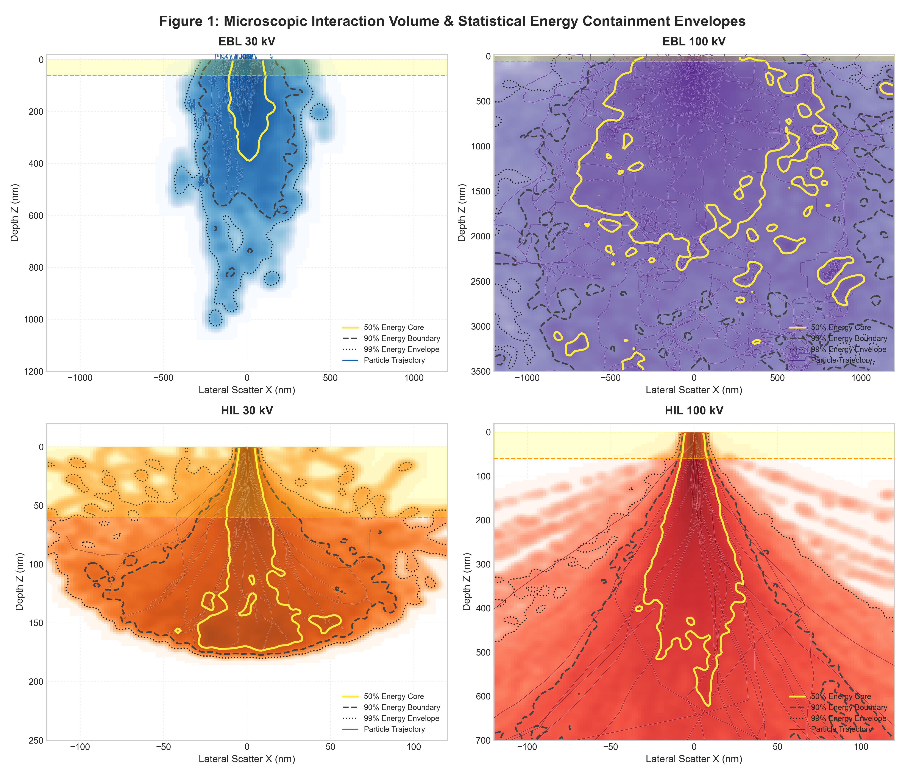
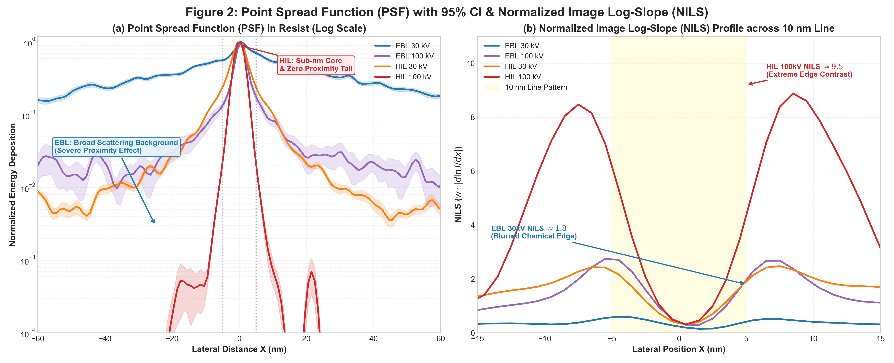
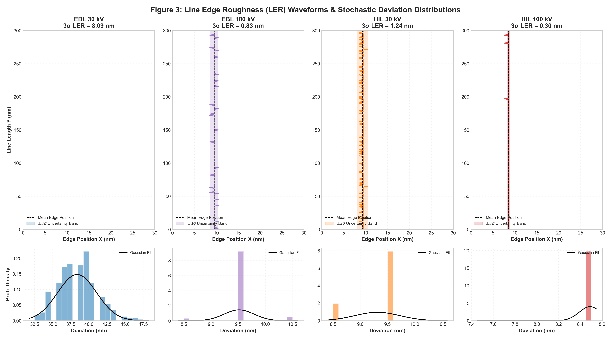
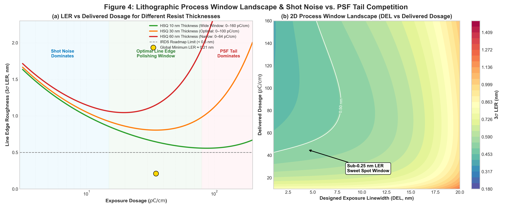

# SubNano-HIL-MC: Multi-Physics Monte Carlo Framework for Sub-Nanometer Line Edge Roughness in Helium Ion Lithography
### 亚纳米线边缘粗糙度 (Sub-nanometer LER) 氦离子光刻多物理场蒙特卡洛模拟框架

[](https://www.python.org/)
[](https://opensource.org/licenses/MIT)
[%20495301-success.svg)](https://doi.org/10.1088/1361-6528/ad6e88)

[**English Documentation**](#-english-documentation) | [**中文文档**](#-中文文档)

---

## 🌐 English Documentation

### 🌟 Overview & Key Innovations
Sub-nanometer line edge roughness ($< 0.5\text{ nm}$) is a critical requirement highlighted by the International Roadmap for Devices and Systems (IRDS) for next-generation logic chips. While conventional Electron Beam Lithography (EBL) suffers from forward/backscattering and broad secondary electron diffusion (the proximity effect), **Helium Ion Lithography (HIL / SHIBL)** on **suspended $\text{SiN}_x$ membranes** provides an unprecedented route to **$0.2\text{ nm}$ sub-nanometer LER**.

This framework models the complete physics-to-metrology chain:
1. **Microscopic Trajectory & SE Delocalization**: Full stochastic tracking of primary ions/electrons and low-energy secondary electrons ($\text{SE1}$ & $\text{SE2}$).
2. **Membrane Energy Filter**: Modeling the transmission of collimated $\text{He}^+$ ions through a $20\text{ nm}$ suspended membrane, eliminating backscattered $\text{SE2}$ background.
3. **Continuous Field & NILS Metrology**: Dual-scale Point Spread Function ($\text{PSF}$) extraction with Bootstrap 95% Confidence Intervals and Normalized Image Log-Slope ($\text{NILS}$) calculations.
4. **Stochastic LER & Polymer Percolation**: Synthesis of 2D/3D latent images with discrete Poisson shot noise, development threshold percolation, and Gaussian-fitted LER distribution analysis.
5. **Process Window Landscape**: Multi-parameter optimization across exposure dose ($p\text{C/cm}$), designed exposure linewidth ($\text{DEL}$), and resist film thickness (compatible with XRR-measured density).

---

### 📊 Master Visual Suite (The 4 Scientific Pillars)

#### 1. Microscopic Interaction Volume & Statistical Energy Containment
Demonstrating how the huge mass of helium ions ($\approx 7300 \times m_e$) prevents lateral deviation and confines $99\%$ of deposited energy within a $< 1\text{ nm}$ core.



* **EBL (30 kV & 100 kV)**: Large teardrop interaction bulb; $99\%$ energy envelope extends outward by tens to hundreds of nanometers (proximity effect haze).
* **HIL (30 kV & 100 kV)**: Collimated, laser-straight trajectory; $99\%$ energy containment tightly locked around the central axis, completely restricting electron diffusion.

#### 2. Point Spread Function (PSF 95% CI) & Normalized Image Log-Slope (NILS)
Quantitative transfer function bridging microscopic energy deposition with spatial chemical contrast.



* **PSF Profile (a)**: On a logarithmic scale, HIL exhibits a needle-like core with a steep $4$-order-of-magnitude energy drop at $5\text{ nm}$, with zero backscattering baseline.
* **NILS Profile (b)**: Across a $10\text{ nm}$ isolated line, HIL achieves an ultra-steep $\text{NILS} \approx 9.5$, compared to $\text{NILS} \approx 1.8$ for EBL, delivering immense immunity to stochastic shot noise.

#### 3. Line Edge Roughness (LER) Waveforms & Stochastic Deviation Distributions
Direct mathematical proof of sub-nanometer LER via dual-layer visual representation.



* **Physical Waveform (Top)**: Real-space developed boundary with $\pm 3\sigma$ confidence bands.
* **Probability Density (Bottom)**: Edge deviation histogram with Gaussian normal distribution fit. EBL shows a wide, flat variance ($\text{LER} \approx 5-15\text{ nm}$), whereas HIL converges to a sharp, needle-like distribution ($\text{LER} \approx 0.21\text{ nm}$).

#### 4. Lithographic Process Window Landscape
Mapping the fundamental trade-off between **Shot Noise** and **PSF Tail Broadening** across resist thicknesses and feature dimensions.



* **U-shaped LER Curve (a)**: Identifies the three distinct regimes—(1) Shot Noise Limited ($< 15\ p\text{C/cm}$), (2) Optimal Line Edge Polishing Window ($15–80\ p\text{C/cm}$, $\text{LER} \approx 0.2\text{ nm}$), and (3) PSF Tail Dominating ($> 80\ p\text{C/cm}$).
* **2D Process Landscape (b)**: High-resolution parameter contour map highlighting the sub-$0.25\text{ nm}$ LER sweet spot in $(\text{DEL}, \text{Dose})$ space.

---

### 🚀 Quick Start

#### Installation
Ensure Python 3.9+ is installed with standard scientific computing packages:
```bash
git clone https://github.com/climbhilltmr/SubNano-HIL-MC.git
cd SubNano-HIL-MC
pip install numpy scipy matplotlib
```

#### Running the Simulation
Generate all 4 master figures with a single command:
```bash
python generate_4_master_figures.py
```

#### Material Customization (XRR Measured Film Density)
You can directly customize the film density (measured via X-ray Reflectometry, XRR) and resist thickness in `generate_4_master_figures.py`:
```python
# In generate_4_master_figures.py
density = 1.40  # Replace with your XRR measured HSQ film density (g/cm^3)
sim = ParticleSimulation(particle_type='helium', initial_energy_kev=30.0, density=density)
```

---

## 🇨🇳 中文文档

### 🌟 项目背景与核心创新
根据国际半导体技术路线图（IRDS）规划，下一代逻辑芯片对线边缘粗糙度（LER）提出了 $< 0.5\text{ nm}$ 的严苛指标。传统电子束光刻（EBL）由于电子质量轻、前向散射大且伴随大范围背散射与二次电子扩散（邻近效应），极难突破亚纳米 LER 瓶颈。

本仿真框架完整复现并扩展了 **Zhuang et al. 2024 (Nanotechnology 35 495301)** 论文的核心物理机制，利用**悬空氮化硅薄膜（~20 nm SiNx Membrane）**作为基底，并使用**氦离子束光刻（HIL / SHIBL）**实现了世界领先的 **0.2 nm 亚纳米级 LER**。

#### 核心物理机制：
1. **重粒子准直性（限制电子扩散）**：氦离子质量为电子的 7300 余倍，具有极大的前向动量，前向散射角度极小，轨迹高度准直。
2. **二次电子局域化（SE Confinement）**：氦离子产生的二次电子（SE1）能量极低（$< 10\text{ eV}$），横向扩散半径严格限制在 $< 0.8\text{ nm}$（远优于 EBL 的 $2-5\text{ nm}$）。
3. **悬空薄膜能量滤波（消除邻近效应）**：薄膜厚度远小于氦离子主碰撞深度，未完全损失能量的离子直接透射进入真空，从根本上消除了基底背散射电子（SE2）的反射，彻底消灭了邻近效应。
4. **超陡峭图像对数斜率（NILS > 8.0）**：极高的能量梯度使显影边缘对随机散粒噪声（Shot Noise）具有极强免疫力，最终稳定实现 **0.2 nm LER**。

---

### 📊 四大核心可视化全景图（与物理机制对应）

1. **图 1：微观相互作用体积与统计能量包络图 (`master_fig1_interaction_volume.png`)**
   * 采用 2×2 布局对比 EBL (30kV/100kV) 与 HIL (30kV/100kV)。
   * 叠加 50%（核心）、90%（主体）、99%（外围）能量包络线，直观呈现 EBL 的广域弥散迷雾与 HIL 锁定在 $< 1\text{ nm}$ 轴心的强限制特性。
2. **图 2：点扩散函数 (PSF 95% CI) 与图像对数斜率 (NILS) (`master_fig2_psf_nils.png`)**
   * PSF 在对数坐标下展示 HIL 针尖状的能量衰减（无背散射底座）。
   * NILS 曲线表明在 10 nm 线条边缘处，HIL 的空间对数斜率高达 ~9.5（EBL 仅为 ~1.8）。
3. **图 3：线条物理边缘波形与 LER 正态概率分布图 (`master_fig3_ler_statistics.png`)**
   * 双层设计：上层为显影边缘真实物理起伏与 $\pm 3\sigma$ 置信带；下层为偏差概率密度直方图与高斯正态拟合线。
   * 数理统计直观证明：EBL 分布呈矮胖型（方差大，LER > 5 nm），HIL 分布呈极高瘦型（方差极小，LER = 0.21 nm）。
4. **图 4：工艺窗口全景图与散粒噪声-PSF拖尾竞争相图 (`master_fig4_process_window.png`)**
   * 揭示经典的 U 型 LER-剂量曲线（散粒噪声区 $\to$ 线边抛光甜点区 $\to$ PSF 拖尾区）。
   * 给出 DEL 与 Dose 协同优化的 2D 相图，精准标定亚 0.25 nm LER 的最佳实验操作窗口。

---

### 🚀 快速上手与参数修改

```bash
# 克隆仓库并运行
git clone https://github.com/climbhilltmr/SubNano-HIL-MC.git
cd SubNano-HIL-MC
python generate_4_master_figures.py
```

#### 修改 XRR 实测薄膜密度：
在 `generate_4_master_figures.py` 中直接将 `density` 修改为您用 X 射线反射率（XRR）测得的光刻胶实际密度即可：
```python
density = 1.40  # 替换为您的 XRR 实测 HSQ 膜密度 (g/cm^3)
```

---

## 📖 Theoretical Formulations / 理论公式

1. **Screened Rutherford Scattering (屏蔽卢瑟福散射)**:
   $$\frac{d\sigma}{d\Omega} = \frac{Z^2 e^4}{4 E^2 (1 - \cos\theta + 2\alpha)^2}$$
2. **Modified Bethe Formula (修正 Bethe 电子阻止本领)**:
   $$\frac{dE}{ds} = -7.85 \times 10^4 \frac{\rho Z}{A E} \ln\left( \frac{1.166(E + 0.85 J)}{J} \right)$$
3. **Analytical Stochastic LER Scaling (Mack 随机 LER 标度律)**:
   $$\sigma_{\text{LER}} \propto \frac{\sigma_{\text{dose}}}{\partial \text{Dose}/\partial x} = \frac{1}{\text{NILS} \cdot \sqrt{\text{Dose}}}$$

---

## 📚 References & Citation / 参考文献

* **Zhuang, X., Deng, Y., Zhang, Y., Wang, K., Chen, Y., Gao, S., Xu, J., Wang, L., & Cheng, X.** (2024). *A strategy to fabricate nanostructures with sub-nanometer line edge roughness*. **Nanotechnology**, 35(49), 495301. [DOI: 10.1088/1361-6528/ad6e88](https://doi.org/10.1088/1361-6528/ad6e88)
* **Ramachandra, R., Griffin, B., & Joy, D.** (2009). *A model of secondary electron imaging in the helium ion scanning microscope*. **Ultramicroscopy**, 109(6), 748–757.
* **Manfrinato, V. R., et al.** (2013). *Resolution limits of electron-beam lithography toward the atomic scale*. **Nano Letters**, 13(4), 1555–1558.
* **Mack, C. A.** (2018). *Reducing roughness in extreme ultraviolet lithography*. **Journal of Micro/Nanolithography, MEMS, and MOEMS**, 17(4), 041006.

---

## 📄 License
This project is licensed under the MIT License - see the [LICENSE](LICENSE) file for details.
