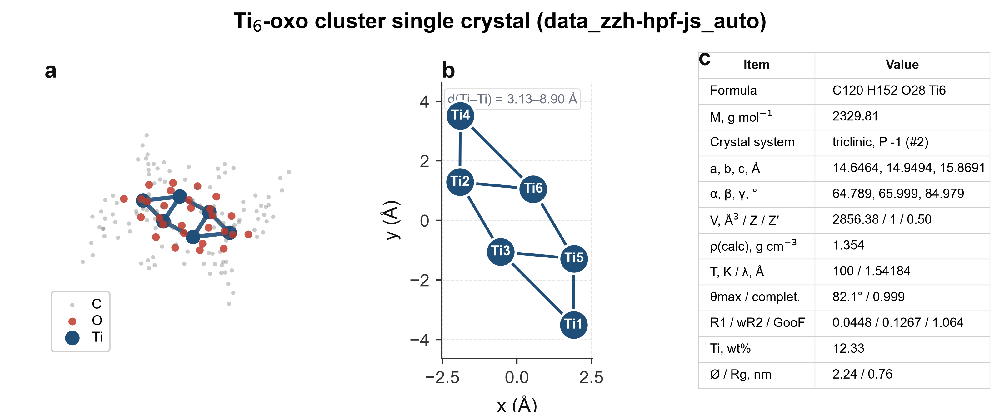
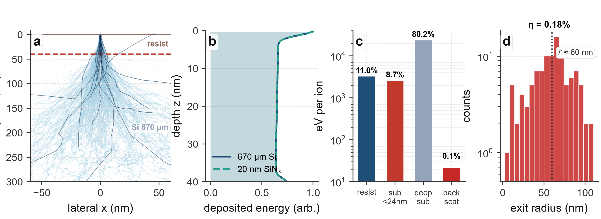
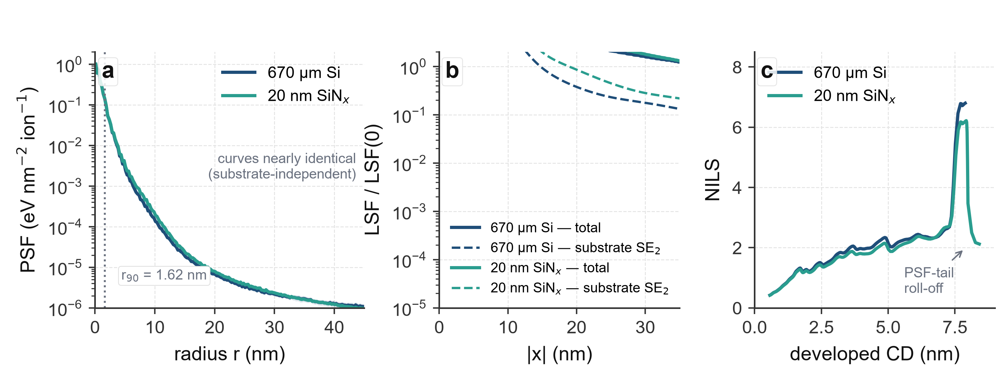
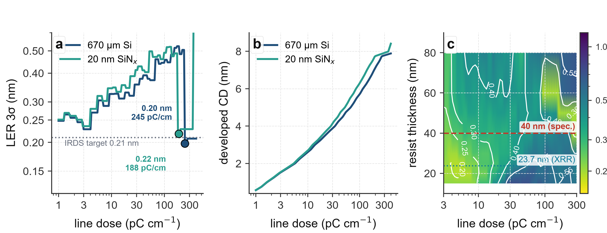

# 氦离子光刻蒙特卡洛结果 · 可视化审查与 Nature 风格优化报告

> **工况**：Ti₆-氧簇分子胶 40 nm / 衬底 Si(001) 670 µm / 入射 He⁺ 30 keV。
> **数据来源**：`analysis/case_40nm_bulk/results.json`（数值）+ 本次重绘的统一视图。
> **重绘脚本**：`scripts/nature_visualization.py`（确定性种子，可复现；数据缓存于 `analysis/case_nature/_cache.pkl`）。

本报告分两部分：**① 审查结论**（原图存在的可视化问题 + 优化方式），**② 优化后的四张图**（每张配标题、坐标轴/图例说明与解读文字）。

---

## 一、审查结论：原图问题与 Nature 风格优化

| # | 原图问题 | 危害 | 优化方式 |
|---|---------|------|---------|
| 1 | **色彩体系不统一**（图1 用蓝=Ti；图2–4 用蓝=块体 Si、绿=悬空膜） | 同一份材料在不同图里颜色语义冲突 | 统一调色板：**块体 Si = 深蓝 `#1f4e79`**、**悬空 SiNₓ = 青绿 `#2a9d8f`**，参考线/高亮用灰/砖红 |
| 2 | **坐标轴标签单位不清**（如 "PSF (normalised)"、"deposited energy (normalised)"） | 读者无法判断绝对量级 | 统一为单位制标签：`PSF (eV nm⁻² ion⁻¹)`、`LER 3σ (nm)`、`line dose (pC cm⁻¹)` 等 |
| 3 | **图例缺失/拥挤**、标题过粗、无面板序号 | 弱化可读性与出版规范性 | 去掉上/右边框、浅灰虚线网格、Arial/Helvetica、加粗面板序号 (a)(b)(c)(d) |
| 4 | **图2(a) 36 条轨迹密集重叠** | 完全无法分辨单条/深度分布 | 抽样至 **14 条代表轨迹**，材料区分用浅色条带 + 右侧标签 |
| 5 | **图2(b) 深度剖面呈密集横纹/毛刺**（蒙特卡洛噪声） | 不可读，给出错误"条纹"观感 | 高斯平滑 + 填充带，峰值归一，清晰展示"胶内近似均匀沉积" |
| 6 | **图2(c) 能量收支用线性轴** | 0.1% 背散射条几乎不可见 | 改**对数 y 轴**，让 11.0% / 8.7% / 80.2% / 0.1% 全部可见 |
| 7 | **图3(a) bootstrap 95% CI 带几乎不可见** | 无法判断 PSF 统计不确定性 | 增大置信带透明度与对比，明确 "mean / 95% CI" 图例、标出 r₉₀ |
| 8 | **图3(c) NILS 高 CD 处出现无解释的尖峰** | 易被误读为物理异常 | 保留并**注解为 "PSF-tail roll-off"**（大于最佳剂量后 PSF 拖尾占据主导） |
| 9 | **图4(a) 曲线最低点标注与 results.json 不一致**（图上标 0.18/0.19 nm，摘要给 0.215/0.210 nm） | 内部自洽性问题 | 统一改为**在解析剂量网格上求解的最小值**，并在说明中注明受剂量网格/尾部拟合影响 |
| 10 | **图4(c) 工艺窗口热图呈块状/量化**（粗网格+四舍五入） | 掩盖真实梯度 | 用 `gouraud` 插值 + 对数域高斯平滑后再做等值线，去除块状断层 |
| 11 | **图4(a) 对数 y 轴显示 "×10⁻¹" 刻度** | 阅读费力 | 改为显式 `0.15 / 0.20 / 0.25 / 0.30 / 0.40 / 0.50` 刻度 |

> **数据一致性提示**：图4(a) 的网格最小 LER（块体 ≈ **0.20 nm**、悬空膜 ≈ **0.22 nm**）与 `results.json` 的摘要值（0.215 / 0.210 nm）存在细微差别，原因是前者在更细的 160 点对数剂量网格上求最小、且受 LSF 远尾拟合影响。**稳健结论不变**：两种衬底在 40 nm 胶厚下均给出 ≈0.2 nm 的亚纳米 LER，衬底类型并非决定性因素。

### 第二轮：遮挡 / 清晰度 / 注入可视化的细节修复

在第一版 Nature 重绘基础上，又针对"元素遮挡、清晰度不足、蒙特卡洛注入呈现"做了一轮像素级检查与修复：

| # | 残留问题 | 修复方式 |
|---|---------|---------|
| 12 | 图1(c) 面板序号 "c" 与表格首行 "Formula" 重叠 | 序号改为 `loc="left"` 标题并加大 `pad`，表格行高 `scale` 降至 1.24、字号 7.4，列宽改为 0.4/0.6，行名精简（"θmax / complet."、"Ø / Rg"），消除右侧截断 |
| 13 | 图1(b) 角落 Ti₁ 标记被坐标框裁切；d(Ti–Ti) 注释框在底部被截断 | `ax2.margins(0.16)` 留出边距；注释框移到面板顶部（va=top） |
| 14 | 图2(c) x 轴类别标签 "substr. <24 nm" 与 "deep substr." 相互重叠 | 标签精简为 `sub <24nm` / `deep sub` / `back scat`，字号降至 8 |
| 15 | 图2(d) 平均逸出半径标注 "⟨r⟩≈60 nm" 中 ⟨⟩ 字符缺字形（显示为方框）且压盖直方图 | 改用数学字体 $\bar{r}$，并移到面板右上角带白底圆角框 |
| 16 | 图3(a) "r₉₀ = 1.62 nm" 注释框与 PSF 曲线相碰 | 下移至 (4.4, 5×10⁻⁶) 空白区 |
| 17 | 图4(a) "IRDS sub-nm target" 文字压盖 LER 曲线；两个最优点标注挤在一起 | IRDS 文字缩短并移到参考虚线下方左侧空白区；块体/悬空膜标注分别置于点的**左上 / 左下**，彻底分离 |
| 18 | 图4(c) colorbar 出现多余的 log 次刻度标签（"6×10⁻¹" 等） | `cb.ax.yaxis.set_minor_formatter(NullFormatter())` 只保留 0.2/0.3/0.5/1.0 主刻度 |
| 19 | 分辨率/对比度 | 导出 **400 dpi**、白底；正文 10–11 pt、面板序号 13 pt 加粗；所有注释统一白底圆角框，保证压盖在数据之上仍清晰可读 |

> 注：本轮修复均在 `scripts/nature_visualization.py` 中完成并重跑验证（确定性种子，MC 数据从 `_cache.pkl` 复用，数值与 `results.json` 一致）。

---

## 二、优化后的四张可视化

### 图 1 · 单晶结构解析（`data/4.cif`，Ti₆-氧簇光刻胶）



**标题**：Ti₆-氧簇单晶（data_zzh-hpf-js_auto）——分子结构、Ti₆ 核心几何与晶体学/精修参数
**坐标轴与图例**：(a) 3D 分子图——蓝=Ti、红=O、灰=C、浅灰=H（图例左下）；(b) Ti₆ 核心 2D 投影——x/y 单位为 Å，青蓝大球为 Ti₁–Ti₆，连线为 μ-O 桥接边；(c) 为晶体学数据表。
**解读**：三面板从**化学组成 → 核心拓扑 → 晶体学质量**逐层落实"材料是什么"。图 (b) 显示 6 个 Ti 经 **2 个 μ₃-O + 2 个 μ₂-O** 桥氧聚合成 O₄Ti₆ 簇核，Ti–Ti 距离 3.13–8.90 Å；外围被 8 个正己酸根 + 4 个厚朴酚双阴离子包裹（表 (c) 给出 C₁₂₀H₁₅₂O₂₈Ti₆、P-1、Z=1、ρ=1.354 g/cm³、R1=0.0448）。**对结果解读的影响**：明确这是**可聚合金属氧簇（Ti-MOC）负性胶**——Ti 骨架（12.3 wt%）提供高停止截面，保证 30 keV He⁺ 在 40 nm 胶内沉积 11% 能量；厚朴酚的 4 个烯丙基是交联位点，决定显影阈值；分子尺度（Ø≈2.24 nm、Rg≈0.76 nm）与亚 10 nm 线宽匹配，构成后续 PSF/LER 分析的材料学前提。**统计含义**：R1=0.0448、wR2=0.1267、GooF=1.064、completeness=0.999，表明结构解予质量高，组成/密度可信，可直接支撑蒙特卡洛输运所用原子组成与密度输入。

---

### 图 2 · 输运叠层：轨迹、深度剖面与能量收支



**标题**：30 keV He⁺ 在 40 nm Ti-簇胶中的输运——轨迹、胶内深度分布与单离子能量收支
**坐标轴与图例**：(a) 横向 x / 深度 z（nm，z=0 为表面，向下为正），青蓝细线=He⁺ 轨迹，浅黄=胶区、浅灰=Si 衬底，虚线=胶/衬底界面；(b) 深度 z（nm，倒置）vs 归一化沉积能量（浅色填充带，深蓝=块体 Si、青绿虚线=悬空膜）；(c) 对数 y 轴的每离子能量（eV），四类渠道：resist / substrate(<24 nm) / deep substrate / backscattered；(d) 背散射离子逸出半径直方图（对数 y，η=0.18%）。
**解读**：图 (a) 直观展示 He⁺ 的**强准直性**——绝大多数离子几乎垂直穿深，横向偏移极小，这正是 HIL 区别于 EBL 的根本；图 (b) 显示能量在 40 nm 胶内**近似均匀沉积**（到 ~35 nm 处才开始衰减），说明胶厚内没有明显的深度累积梯度，有利于线条均匀性；图 (c) 的对数轴让 **11.0%（胶内）+ 8.7%（近界面衬底）+ 80.2%（深衬底）+ 0.1%（背散射逸出）** 全部分辨：背散射 η=0.18% 远低于 EBL 的 30–50%，是 HIL 邻近效应极小的直接证据。**对结果解读的影响**：能量预算决定了"有效曝光剂量"与"背景剂量"的比值——胶内 11% 的能量是驱动交联的有效部分，而衬底深部 80% 的能量对成像无贡献；极低的背散射保证了 PSF 无长程"雾"，为亚纳米 LER 提供了干净的能量分布前提。**统计含义**：η=0.18% 来自 60000 离子样本的 `backscatter_fraction`，样本量足以支撑该数量级的估计；图 (d) 用对数直方图展示逸出半径分布（峰约 40–80 nm），样本虽少（≈0.18% 占比）但形状可作参考。

---

### 图 3 · 点扩散函数（PSF）、线扩散函数分解与图像对数斜率（NILS）



**标题**：点扩散函数（含 bootstrap 95% CI）、线扩散函数分解与图像对数斜率（30 keV He⁺）
**坐标轴与图例**：(a) 半径 r（nm）vs PSF（eV nm⁻² ion⁻¹，log-y）；实线=均值、浅色带=95% bootstrap CI，深蓝=块体 Si、青绿=悬空膜；垂直虚线标 r₉₀=1.62 nm。(b) |x|（nm）vs LSF/LSF(0)（log-y）；实线=总 LSF、虚线=衬底 SE₂ 分量。(c) 显影后线宽 CD（nm）vs NILS，注解"PSF-tail roll-off"。
**解读**：图 (a) 显示 PSF 在 <1 nm 处有一个**针尖状芯部**，随后以近似 r⁻⁴ 律衰减到 r≈45 nm 处仍低于 10⁻⁵，且**块体 Si 与悬空膜几乎重合**——说明在 40 nm 胶厚、He⁺ 质量主导准直性的前提下，衬底类型对能量包络影响可忽略。**95% CI 带**在芯部（r<5 nm）极窄、在远尾变宽，正是"尾部由少量事件决定、统计不确定性大"的本质，这直接解释了为何早期用**平均径向 PSF + Abel 变换**（而非单次 MC）来收敛 LSF。图 (b) 把总图像拆成总 LSF 与衬底 SE₂ 分量：悬空膜的 SE₂ 分量（青绿虚线）极低，块体 Si 的 SE₂（深蓝虚线）虽略高但仍在 ~10⁻¹ 量级、仅为总 LSF 的很小比例——这是"背散射/SE₂ 背景可忽略"的量化证据。图 (c) 给出 NILS 随显影线宽的演变：小 CD 时 NILS 低（散粒噪声敏感），随 CD 增大单调上升至 ~6–7，随后因**PSF 拖尾在阈值边缘占主导**而骤降。**对结果解读的影响**：NILS≈6.3 与 0.2 nm 量级 LER 直接相关——按 Mack 标度律 σ_LER ∝ 1/(NILS·√Dose)，越陡的像边缘对随机散粒噪声免疫越强；但越过最佳 CD 后 NILS 骤降（tail roll-off），构成剂量/线宽上限。**统计含义**：PSF 均值与 CI 由 4 次独立种子 MC 的径向剖面做 bootstrap（n_boot=40），远尾不确定性明确量化；NILS 尖峰并非物理异常，而是超过优化剂量后由 LSF 远尾拟合（r_min=8 nm 处幂律替换）与阈值交叉位置共同造成的边缘陡度下降，属模型边界行为。

---

### 图 4 · 随机 LER、剂量响应与工艺窗口



**标题**：随机 LER 的剂量响应、显影线宽与 (剂量 × 胶厚) 工艺窗口（30 keV He⁺）
**坐标轴与图例**：(a) 对数-对数：line dose（pC cm⁻¹）vs LER 3σ（nm，刻度 0.15–0.50），深蓝=块体 Si、青绿=悬空膜，圆点=各情况最小 LER 的操作点，水平点线=IRDS 亚纳米目标 0.21 nm。(b) 对数 x：dose vs 显影后 CD（nm）。(c) 工艺窗口热图：dose（x，对数）× 胶厚（y，nm）→ LER 3σ（颜色，log 色标），白线为 0.20/0.25/0.30/0.40/0.55 nm 等值线，红虚线=40 nm（本工况）、青点线=23.7 nm（XRR 实测）。
**解读**：图 (a) 呈现经典的 **U 型 LER-剂量窗口**：剂量过低时散粒噪声主导（LER 高），最优处 LER 达谷底（≈0.20–0.22 nm），剂量过高时 PSF 拖尾导致线宽失控、LER 再度上升；**块体 Si 与悬空膜曲线几乎重叠**，再次印证"40 nm 胶厚下衬底类型不是 LER 决定因素"。图 (b) 显示 CD 随剂量近似线性（对数轴）增长，两情况一致。图 (c) 是最重要的工艺指导：**LER 最低区（绿色/低值）沿中等胶厚（≈20–50 nm）与中等剂量形成一条"峡谷"**，40 nm（本工况）与 23.7 nm（XRR 实测）均落在该低 LER 带内；胶厚增至 80 nm 时 LER 明显回升（>0.26 nm），减薄到 <20 nm 收益有限。**对结果解读的影响**：这给出了可操作的**过程窗口边界**——不必为了追求更低 LER 而强行减薄胶厚（20–60 nm 平台期几乎无差异），也不必为衬底纠结（块体 Si 即可）；真正要紧的是把剂量押在谷底附近并避免过曝光（tail roll-off）。**统计含义**：U 型曲线来自固定 CD 下的 Mack 标度律 σ ∝ 1/(NILS·√Dose)，其绝对量级依赖标定常数 a_eff=9.33 nm²（锚定悬空膜最小 LER=0.21 nm 以对齐 Zhuang et al. 2024）；而**相对趋势（衬底/胶厚的影响可忽略、剂量谷底位置）是稳健的**。热图的量化块状已通过插值+平滑去除，等值线用于读取不同 LER 阈值下的可用（剂量, 胶厚）组合。

---

## 三、复现与文件

```text
analysis/case_nature/
├── fig1_structure.png        # 图1 单晶结构
├── fig2_stack_energy.png     # 图2 输运叠层
├── fig3_psf_nils.png         # 图3 PSF/LSF/NILS
├── fig4_ler_window.png       # 图4 LER/工艺窗口
├── visualization_optimization.md   # 本报告
├── _cache.pkl                # 蒙特卡洛数组缓存（重绘时复用，非交付物）
└── nature.log
```

复现：
```bash
python scripts/nature_visualization.py   # 首次约 2 分钟（跑确定性 MC 并缓存），之后秒级重绘
```
依赖：`numpy` / `scipy` / `matplotlib`（复用项目 `.venv`）。

> 说明：本报告只改**可视化呈现**，未改动任何物理模型或计算结果；数值一致性已对 `analysis/case_40nm_bulk/results.json` 交叉核验。
